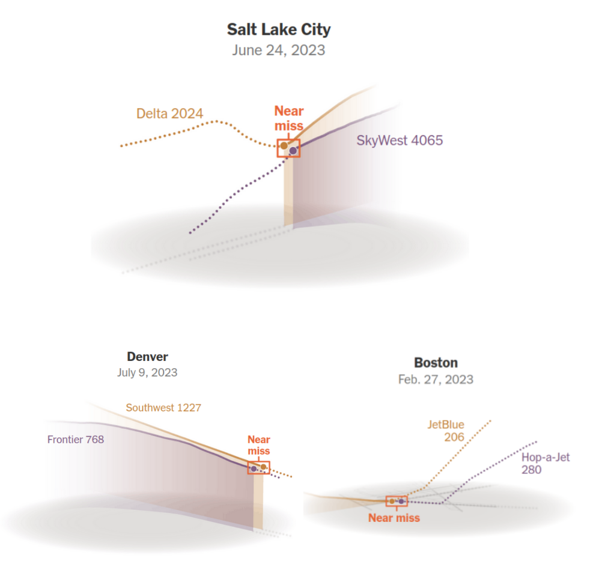
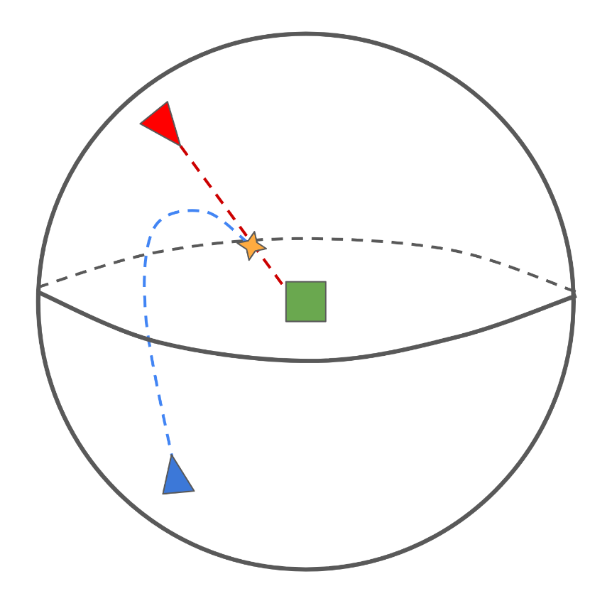
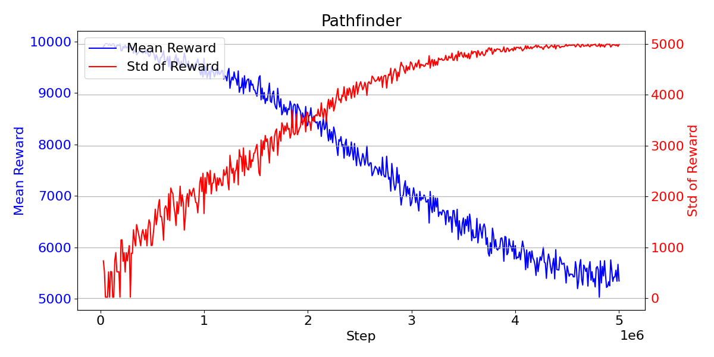
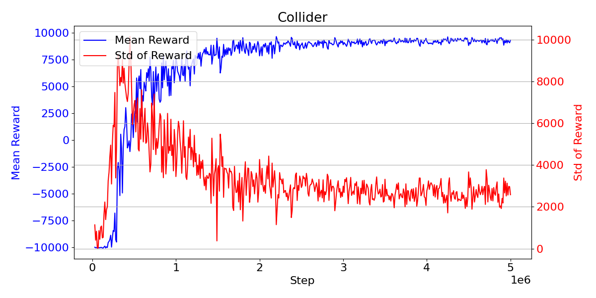

# Reinforcement Learning-Based Aircraft Collision Avoidance System (SOSNA)

## Table of Contents
1) [Introduction](#Introduction)
2) [Approach](#approach)
3) [Experiments](#experiments)
4) [Results](#results)
5) [Future Word](#future-work)

## Introduction
This project focuses on developing a reinforcement learning-based
system for aircraft collision avoidance.
The system is designed to prevent potential vehicle impacts,
a critical aspect of transportation safety.

With the rise of commercial flights and drone usage,
the airspace is more crowded than ever. 
Errors in communication, navigation systems, or air traffic control instructions
can lead to potential collisions.
In 2023, NASA's Aviation Safety Reporting System
recorded around 300 commercial aircraft near-collisions in the US.

[//]: # (![]&#40;sosna_exp.png&#41;)

  

## Approach
In order to simulate airplane movements and interactions,
we use the Unity 3D Engine.
Unity's robust physics simulation and integration of ML-Agents Toolkit
allows us to conduct experiments and train agents easily.   

The simulation environment is bounded by a sphere.
This boundary ensures that agents remain within a defined space,
preventing them from moving too far apart during training.
At the center of the sphere, green cube placed as target for the Pathfinder agent.

[//]: # (![]&#40;Assets/Report/images/environment.png&#41;)

  

### Agents:
The system involves two types of agents, each with distinct roles:

1. **Pathfinder:**
   - _**Objective**_: Reach the target cube, while avoiding collisions with the Collider.

2. **Collider:**
   - Objective: Attempts to Intercept the Pathfinder before it reaches the target.

Both agents are equipped with variable thrust engines,
allowing for controls similar to those of an aircraft,
including yaw, pitch, and roll.
Gravitation is not considered in the simulations,
but linear and angular friction forces are enabled
to prevent oscillations and ensure stable movement.

## Experiments
The project was divided into three stages.
At first stage we trained simple agent to find the path to the green cube. (Pathfinder)
At second stage, we introduce Collider agent. Weights of Pathfinder agent was frozen,
while Collider was trained to encounter with Pathfinder. 
At the final stage, we unfroze weights of Pathfinder.
Both Pathfinder and Collider were trained at this stage.

## Results
The collider reward mean
starts from -10,000 (penalty for leaving the bounding
sphere). As training progresses, the average reward for
the collider increases, while that for the pathfinder
decreases 4, indicating that the collider is successfully
intercepting it. Finally, collider reward reaches +10,000
(reward for intercepting the pathfinder), while pathfinder
reward is getting closer to 0.

  

  

[//]: # (![]&#40;Assets/Report/images/pathfinder_plot.png&#41;)
[//]: # (![]&#40;Assets/Report/images/collider_plot.png&#41;)

## Demonstration

[Here is the Report.](Assets/Report/Report.pdf)
